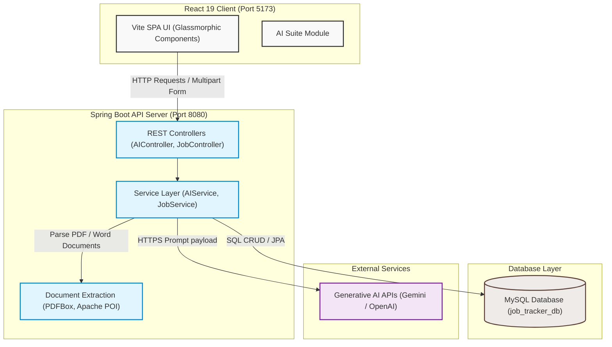
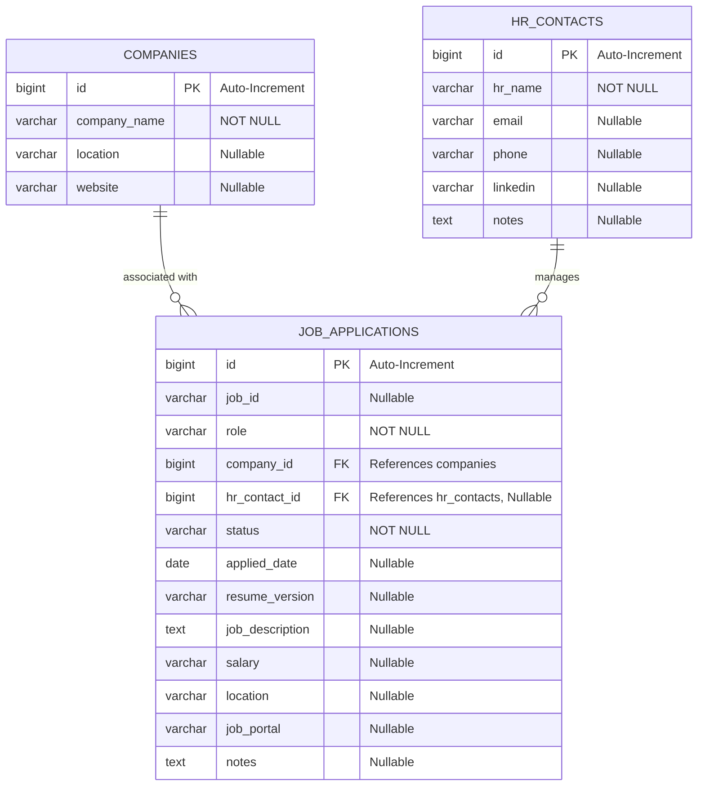
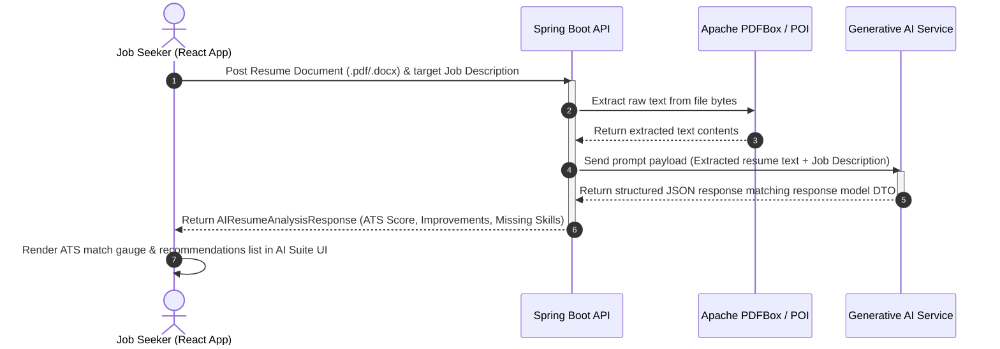

# 📋 AI Job Tracker - Architecture, Schema & Workflow Specification

This document presents the formal technical architecture, database schema, and data workflow diagrams for the AI-Powered Job Application Tracker.

---

## 1. System Architecture Diagram

---

## 2. Database Schema (Entity Relationship Diagram)

---

## 3. Resume Analysis Data Workflow

