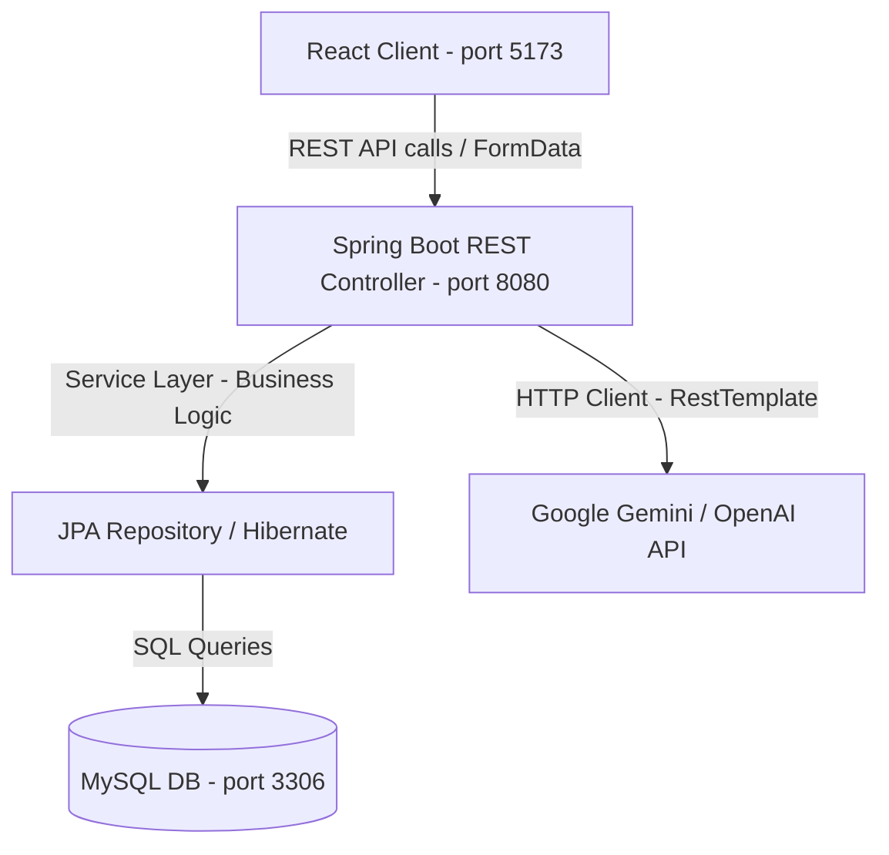
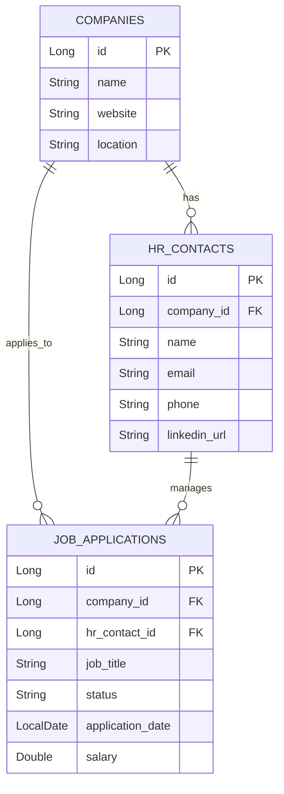

# 🎯 AI-Powered Job Application Tracker: Ultimate Interview Prep Masterclass

This master document serves as your complete guide to explaining the architecture, tech stack, design patterns, and engineering choices of the **AI-Powered Job Application Tracker** in any technical interview (from Freshers to Senior levels).

---

## 🚀 1. Project High-Level Overview
The **AI-Powered Job Application Tracker** is a full-stack, single-user dashboard application designed to manage the end-to-end job application pipeline. It features automated tracking of companies, HR contacts, and application statuses, powered by an **AI Suite** that performs:
1. **Resume Analysis & Matcher**: Reads uploaded PDF, DOC, or DOCX resumes and computes a real-time ATS match score against job descriptions.
2. **JD Parser & Extractor**: Extracts required skills, experience levels, responsibilities, and search keywords from a job posting.
3. **AI Email Writer**: Generates customized cold outreach and interview follow-up emails.
4. **Interview Prep Guide**: Generates custom technical, coding, database, and behavioral questions for target job roles.

---

## 🛠️ 2. Technology Stack & Technical Rationale

Here is the technical stack utilized in this project, the reason behind each selection, pros & cons, and industry alternatives:

| Layer | Technology | Why We Chose It | Alternatives Considered | Pros | Cons |
| :--- | :--- | :--- | :--- | :--- | :--- |
| **Backend** | **Java 17 + Spring Boot 3.x** | Enterprise standard, rapid bootstrapping, native DI container, spring-data-jpa, robust validation. | Node.js (Express), Python (FastAPI / Django) | Strict type safety, rich ecosystem, easy database integration, multithreaded performance. | Heavy initial memory footprint, verbose boilerplate compared to Python/Node. |
| **Frontend** | **React 19 + Vite 5.4** | Single Page Application (SPA), Virtual DOM, component-based reusability, ultra-fast Vite HMR. | Next.js, Angular, Vue.js | Rapid loading, clean modular UI, light build bundle, massive community. | Client-side rendering (SEO requires extra configuration compared to Next.js). |
| **Database** | **MySQL 8.x** | Structured, relational data with foreign key constraints, ACID compliance, mature querying. | PostgreSQL, MongoDB | Relational integrity (Applications link to Companies & HR Contacts), indexing, free/open-source. | Harder to scale horizontally compared to NoSQL databases. |
| **AI Engine** | **Gemini 1.5 Flash / OpenAI GPT-4o-mini** | Gemini 1.5 Flash provides high context window and low latency for document processing. | Local LLMs (Ollama / Llama-3) | Zero setup hosting, advanced reasoning, JSON-structured response formatting. | Dependency on external API, token usage costs, rate limits. |
| **Document Parsing**| **Apache PDFBox 3.x + POI Scratchpad** | Native Java libraries to extract raw textual context from document streams. | Python PyPDF2, Node-pdfreader | Lightweight, local execution, supports old `.doc` and new `.docx`/`.pdf` files. | Scanning image-only (OCR) PDFs requires extra setup. |

---

## 🏗️ 3. System Architecture & Component Interactions

The project implements a classic **3-Tier Architecture**:

### Flow of Data during Resume Analysis:
1. **Frontend**: The user uploads a `.pdf`/`.docx` file and inputs a Job Description. React packs these into a `FormData` object and fires a `POST` request to `/api/ai/resume-analysis`.
2. **Controller**: `AIController` intercepts the request as a multipart request, validating the file format and confirming size is `< 2MB`.
3. **Service Layer**: `AIService` reads the file stream and invokes `Apache PDFBox` or `Apache POI` to parse raw text.
4. **AI Generation**: The parsed text + job description is passed to `callAI()`. The service formats a strict prompt requiring a JSON-structured response containing the ATS score, missing skills, and improvement ideas.
5. **JSON Parsing**: The backend parses the LLM output using `ObjectMapper` and returns an `AIResumeAnalysisResponse` object to the frontend.

---

## 🗄️ 4. Database Schema Design (ERD & Relations)

The database schema is designed in **Third Normal Form (3NF)** to avoid redundancy and protect data integrity.

### Tables & Relationships:
1. **`companies`**: Stores company details (name, website, location, notes).
2. **`hr_contacts`**: Stores recruiter details (name, email, phone, LinkedIn profile). Represents a **Many-to-One** relationship to `companies` (multiple HRs can work at one company).
3. **`job_applications`**: Stores individual job application data (role, application date, status, notes). Represents a **Many-to-One** relationship to both `companies` and `hr_contacts`.

---

## 🧩 5. Software Design Patterns & SOLID Principles Applied

If asked in an interview: *"What software engineering principles did you use?"*, use these points:

### SOLID Principles:
*   **S - Single Responsibility Principle (SRP)**:
    *   `AIController` only handles HTTP requests/routing.
    *   `AIService` only performs document extraction and AI calls.
    *   `GlobalExceptionHandler` isolates exception interception from business logic.
*   **O - Open/Closed Principle (OCP)**:
    *   `AIService` uses a dynamic `callAI()` dispatch checking `ai.provider` configuration. We can add new providers (Anthropic, Cohere) by adding branches or implementing a provider interface without modifying the controller or UI.
*   **L - Liskov Substitution Principle (LSP)**:
    *   The project uses Spring Data's `JpaRepository`. Any customized repository can substitute `JpaRepository` transparently without breaking query calls.
*   **I - Interface Segregation Principle (ISP)**:
    *   Separate JPA repositories are used for `Company`, `HRContact`, and `JobApplication` rather than a single database repository interface.
*   **D - Dependency Inversion Principle (DIP)**:
    *   Controllers depend on Service abstractions, and Services depend on Repositories, all wired automatically using Spring’s **Dependency Injection (@Autowired/@RequiredArgsConstructor)**.

### Design Patterns Used:
1.  **Builder Pattern**: Used via Lombok's `@Builder` annotation on DTOs and entities for clean, readable, and immutable object construction (e.g., `AIEmailResponse.builder().subject(...).body(...).build()`).
2.  **Singleton Pattern**: Spring beans (Controllers, Services, Repositories) are configured as singletons by default within the Spring IoC container.
3.  **Repository Pattern**: Isolates data access logic in standard Spring Repository classes.
4.  **MVC Pattern (Model-View-Controller)**: Separation of React frontend UI (View), Spring Controllers (Controller), and JPA Entities (Model).

---

## 💬 6. Mock Interview Questions & Answers

### 👶 Freshers (Concepts, Syntax, CRUD)

#### Q1. How does the Spring Boot backend map HTML form data or files uploaded from React?
*   **Answer**: In the backend, we use Spring's `@RestController` with `@PostMapping`. For standard JSON, we use `@RequestBody`. For file uploads, we use `@RequestParam("file") MultipartFile file` along with `consumes = MediaType.MULTIPART_FORM_DATA_VALUE`. Spring Boot automatically binds the incoming multipart file stream to the Java `MultipartFile` argument.

#### Q2. What is the difference between `@RestController` and `@Controller`?
*   **Answer**: `@Controller` is used to serve traditional web pages (like JSP, Thymeleaf). It returns a String indicating which template to render. `@RestController` is a convenience annotation that combines `@Controller` and `@ResponseBody`. It indicates that the class handles REST API requests and automatically converts the returned Java objects directly into JSON/XML payloads using HTTP Message Converters.

#### Q3. What is JPA and Hibernate?
*   **Answer**: JPA (Java Persistence API) is a specification/standard for Object-Relational Mapping (ORM) in Java. Hibernate is the actual framework implementation of the JPA specification. JPA provides the interfaces, while Hibernate implements the underlying SQL query generation and database connection mapping.

---

### 🧑‍💻 Intermediate (Exception Handling, Transaction Management, Custom DTOs)

#### Q4. Why do we use DTOs (Data Transfer Objects) instead of returning raw Database Entities?
*   **Answer**: Returning raw Entities causes several security and architectural issues:
    1. **Data Leakage**: Entities contain internal fields (such as audit logs, passwords, or raw reference IDs) that shouldn't be exposed over APIs.
    2. **LazyLoading Exceptions**: Attempting to access un-fetched relationship fields (like `company.getHrContacts()`) outside a transaction causes Hibernate exceptions.
    3. **Tightly-Coupled APIs**: Modifying database columns directly impacts API schemas. DTOs act as a buffer, allowing the API contract to remain stable even when database tables are refactored.

#### Q5. How is Exception Handling centralized in this application?
*   **Answer**: We implement a `@RestControllerAdvice` class (`GlobalExceptionHandler`). Inside it, we define methods annotated with `@ExceptionHandler` (such as `ResourceNotFoundException.class` or `IllegalArgumentException.class`). When any controller throws an exception, Spring intercepts it and passes it to these handlers to return a structured JSON error response (`ErrorResponse` model) with appropriate HTTP Status Codes instead of throwing raw stack traces to the user.

#### Q6. How did you validate file types and size constraints?
*   **Answer**:
    *   **Size**: On the client side, we check `file.size > 2 * 1024 * 1024`. On the server side, we check `file.getSize() > 2 * 1024 * 1024` and throw an `IllegalArgumentException` if it exceeds 2MB.
    *   **Type**: We extract the file extension using substring extraction on `file.getOriginalFilename()`. We validate that it belongs to the set `{.pdf, .doc, .docx}`.

---

### 👴 Senior (System Design, Security, Scaling, Resiliency)

#### Q7. Describe the primary production challenges you solved in this application.
*   **Answer**:
    1. **Format/Parsing Errors**: When constructing the prompt using `String.format()`, any literal `%` sign present in the template (e.g. `'78%'`) caused `UnknownFormatConversionException: Conversion = ''`. This was fixed by replacing the formatter with standard string concatenation.
    2. **Dependency & Platform Clashes**: Vite 6 has native bindings that caused environment crashes on some local setups. We resolved this by pinning Vite to stable version `5.4.21` and updating lucide-react to ensure full dependency resolution.
    3. **Port Collisions**: Stale Java and Node processes frequently failed to release ports `8080` and `5173`. We wrote a custom PowerShell automation script (`run_app.ps1`) to check active TCP connections, kill process owners using their PID, and start both servers clean.

#### Q8. If this application scaled to 100,000 active users, how would you change the architecture?
*   **Answer**:
    1. **Authentication & Multi-Tenancy**: Introduce Spring Security with stateless JWT authorization. Implement tenant schemas or separate user foreign keys on database tables.
    2. **Asynchronous Processing**: File parsing and LLM API calls are blocking operations. I would offload analysis to an asynchronous worker queue (using RabbitMQ, ActiveMQ, or Kafka). The REST API would return a `202 Accepted` status with a task ID, and the frontend would poll or connect via WebSockets to get results once processing completes.
    3. **Caching**: Cache parsed resume text or frequent AI interview guides in a Redis cache layer to avoid calling costly third-party LLM endpoints multiple times for identical requests.
    4. **Database Scaling**: Introduce MySQL read replicas to distribute reading traffic, and add connection pooling (HikariCP) to optimize database transactions.

---

## ⚡ 7. Core Troubleshooting & Debugging Logs Reference

These are real issues encountered during development and how you solved them:

### Issue 1: `UnknownFormatConversionException: Conversion = ''`
*   **Symptom**: Triggering Resume Analysis throws an internal server error with the message `Conversion = ''`.
*   **Cause**: The prompt template contained `"e.g. '78%'"` using Java's `String.format()`. The formatter interpreted `%` as the start of a format specifier.
*   **Fix**: Switched the prompt template constructor from `String.format(...)` to direct string concatenation (`"..." + request.getResumeText() + "..."`).

### Issue 2: Port `8080` or `5173` already in use
*   **Symptom**: Starting the backend or frontend fails because the port is already bound.
*   **Cause**: Stale background Java or Vite instances from previous runs did not exit cleanly.
*   **Fix**: Created `run_app.ps1` using PowerShell's `Get-NetTCPConnection` to lookup binding PIDs and execute `Stop-Process` dynamically before spawning new instances.
